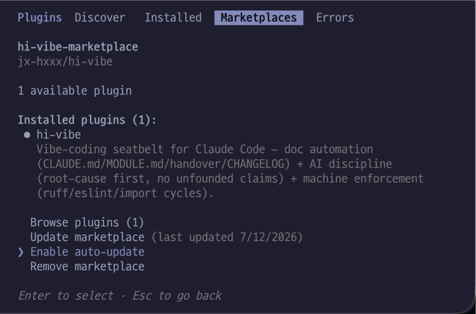

<h1> &nbsp;👋</h1>

[](https://github.com/jx-hxxx/hi-vibe/actions/workflows/test.yml)
[](./LICENSE)


> 🇬🇧 **Read in English → [README.md](./README.md)** · 🇰🇷 한국어로 계속됩니다.

> **AI는 빠르게. 프로젝트는 흐트러지지 않게.**

Claude Code가 이미 있는 코드를 또 만들고, 에러를 덮고, 어제의 결정을
잊는 일을 줄여주는 **바이브 코딩 안전벨트**입니다.

- **만들기 전** — 기존 구현부터 검색
- **Claude가 코드를 쓸 때** — 대표적인 에러 삼킴·비밀키 패턴을 경고
- **세션 사이** — 요청·수정 파일·Git·테스트 상태 자동 기록·복원
- **완료 후** — 코드 리뷰와 문서 동기화

> **처음이세요? 이 3가지만 기억하면 됩니다.**
> 1. 아래 [1분 설치](#1분-설치)의 명령을 순서대로 실행
> 2. 그다음엔 평소처럼 Claude에게 코딩 요청
> 3. 뭔가 이상하면 `/hi-vibe:doctor`

> **먼저 알아둘 점:** hi-vibe는 모든 버그를 자동으로 찾아주는 도구가
> 아닙니다. AI가 대충 넘어가기 쉬운 순간에 근거를 찾고, 기록을 남기고,
> 검증하도록 만드는 작업 규율 + 자동 안전장치입니다.

> **hi-vibe는 Python 프로젝트에 맞춰 만들었습니다.** 모든 훅·스캐너·테스트가
> Python을 대상으로 설계·검증됐습니다. JS/TS(`.js`·`.jsx`·`.ts`·`.tsx`)는
> 심볼·이름 충돌·파일 크기 점검 정도만 되는 **한정적(부분) 지원**이고,
> 중복·유사 함수 탐지 같은 핵심 분석은 **Python에서만** 동작합니다.
> **JS/TS가 주력 언어라면 이 도구에서 얻을 이점이 크게 줄어듭니다.**

<details>
<summary><strong>왜 이렇게 만들었나요? (기술적 배경)</strong></summary>

단순한 프롬프트 묶음이 아닙니다. **실제 Claude Code 훅 5종 · 회귀 테스트
204개 · 프로젝트별 활성화 · Python 표준 라이브러리 기반 핵심 기능**으로
AI가 자주 생략하는 확인·기록·검증을 작업 흐름 안에 넣습니다. 자세한 근거는
아래 [왜 믿을 만한가요?](#왜-믿을-만한가요)에 있습니다.

</details>

<details>
<summary><strong>목차</strong></summary>

- [1분 설치](#1분-설치)
- [설치하면 무엇이 달라지나요?](#설치하면-무엇이-달라지나요)
- [프롬프트 묶음과 무엇이 다른가요?](#프롬프트-묶음과-무엇이-다른가요)
- [왜 믿을 만한가요?](#왜-믿을-만한가요)
- [프로젝트에 만들어지는 문서](#프로젝트에-만들어지는-문서)
- [구조 점검: check](#구조-점검-check)
- [선택형 품질 관문: gate](#선택형-품질-관문-gate)
- [코드 작성 전·후 검증](#코드-작성-전후-검증)
- [명령어 한눈에](#명령어-한눈에)
- [선택 연동](#선택-연동)
- [업데이트](#업데이트)
- [FAQ](#faq)
- [직접 검증해 보세요](#직접-검증해-보세요)
- [크레딧 및 라이선스](#크레딧-및-라이선스)

</details>

---

## 1분 설치

Claude Code 안에서 아래 명령을 차례대로 실행하세요.

```text
/plugin marketplace add jx-hxxx/hi-vibe
/plugin install hi-vibe@hi-vibe-marketplace
/reload-plugins
```

설치가 끝나면 hi-vibe를 사용할 프로젝트 폴더에서:

```text
/hi-vibe:init
/hi-vibe:doctor
```

끝입니다. 이제 이 프로젝트에서는 평소처럼 Claude와 코딩하면 됩니다.

> **설치는 전역 한 번, `init`은 프로젝트마다.**
> `/plugin install`은 기본이 **유저 스코프(전역)** 라, 한 번 설치하면 모든
> 프로젝트에서 `/hi-vibe:` 명령어를 쓸 수 있습니다(프로젝트마다 재설치 X).
> 하지만 자동 기능(에러·비밀키 감지, 자동 handover 등)은 `/hi-vibe:init`으로
> `.hi-vibe/` 마커가 만들어진 폴더에서만 동작합니다.
> **init 안 한 다른 프로젝트에는 전혀 개입하지 않습니다** — 전역 설치인데도
> 원하지 않는 곳에서 훅이 도는 걸 막는 안전장치예요. (그래서 새 프로젝트에서
> 쓰려면 그 폴더에서 `/hi-vibe:init` 한 번.)

> `/reload-plugins`를 꼭 실행하세요. 플러그인을 설치하는 것만으로는 현재
> 세션의 명령어와 훅이 활성화되지 않습니다.

### 언제 무엇을 실행하나요?

| 상황 | 실행할 것 | 횟수 |
|---|---|---:|
| 내 컴퓨터에 처음 설치 | marketplace → install → reload | 한 번 |
| 새 프로젝트에서 사용 시작 | `/hi-vibe:init` | 프로젝트마다 한 번 |
| init이 잘 됐는지 확인 | `/hi-vibe:doctor` | init 직후 또는 문제 있을 때 |
| 구조가 궁금할 때 | `/hi-vibe:check` | 필요할 때마다 |
| lint·CI 관문이 필요할 때 | `/hi-vibe:gate` | 선택, 프로젝트마다 한 번 |
| 평소 코딩 | 자연어로 요청 | 자동 또는 필요 시 명령어 |

**필수 요구사항:** Python 3.8+와 `python3` 명령이 필요합니다. Windows에서
`python3` 명령이 없다면 `python` 별칭을 만들어 주세요.

---

## 설치하면 무엇이 달라지나요?

| 이럴 때 | hi-vibe가 하는 일 | 보장 방식 |
|---|---|---|
| “이 기능 만들어줘” | 기존 함수·파일·타입부터 검색 | 🤖 AI |
| Write/Edit/MultiEdit으로 코드를 작성할 때 | 새 에러 삼킴·하드코딩 비밀키 감지 | ⚙️ 기계 |
| 대화가 compact될 때 | 최근 요청·수정 파일·Git·테스트 상태를 handover에 자동 기록 | ⚙️ 기계 |
| 세션 시작·compact·clear 직후 | 최근 handover와 작업 규율 복원 | ⚙️ 기계 |
| 세션 시작 (문제가 있을 때만) | 훅이 안 돌거나 CI가 연속 실패 중이면 알림 | ⚙️ 기계 |
| “다 했어 / 리뷰해줘” | 코드·엣지케이스·문서 동기화 검토 | 🤖 AI |
| 리뷰 안 받은 코드 변경이 있는 채로 턴이 끝날 때 | 턴을 막고 리뷰를 지시 (직접 칠 필요 없음) | ⚙️ 기계 감지 + 🤖 AI 수행 |
| “예전에 왜 이렇게 했지?” | handover와 아카이브에서 결정 기록 검색 | 🤖 AI |

**⚙️ 기계**는 Python 훅이 실제로 실행합니다. AI가 지침을 기억하는지와
관계없이 작동합니다.

**🤖 AI**는 Claude가 자연어 의도를 알아보고 스킬을 실행합니다. **평소에 이걸
직접 칠 일은 없습니다.** 다만 100% 보장되지는 않으니, 안 걸린 게 눈에 보일
때 `/hi-vibe:find`로 손수 채울 수 있다는 것만 알아두세요. 권장 습관이 아니라
비상 손잡이입니다.

`review`는 그 손잡이도 필요 없습니다. AI가 알아듣고 돌기도 하지만, 놓치면
**턴이 끝날 때 Stop 훅이 대화를 못 끝내게 붙잡고 리뷰를 지시합니다.**
사람이 챙겨야 하는 안전장치는 안전장치가 아니니까요.

다만 정확히 말하면 **기계가 보장하는 건 "리뷰를 요구하는 시점"이고, 리뷰
자체는 Claude가 수행합니다.** 훅은 리뷰가 끝났는지까지는 못 봅니다 — 같은
변경으로 두 번 막지 않으므로, 중간에 끊기면 그 변경은 그냥 넘어갑니다.
(잔소리를 반복하지 않으려는 의도적 선택입니다.)

---

## 프롬프트 묶음과 무엇이 다른가요?

> **Claude Code에는 이미 문서·기억·리뷰·훅 같은 강력한 기본 기능이 있습니다.
> hi-vibe는 이를 대체하지 않습니다.** Python 바이브 코딩에서 자주 빠지는
> 기존 구현 검색·실행 검증·문서 기록을 하나의 가벼운 작업 흐름으로 묶고,
> 일부를 결정적 스크립트(훅·스캐너)로 보강하는 보완 계층입니다.

텍스트 규칙은 AI가 잊거나 건너뛸 수 있습니다. 그래서 hi-vibe는 안전장치를
세 단계로 나눕니다.

1. **문서 자동화** — 프로젝트 구조와 세션 맥락을 기록합니다.
2. **AI 규율** — 만들기 전 검색하고, 원인부터 디버깅하고, 근거를 확인합니다.
3. **기계 강제** — 훅과 선택형 lint·CI가 AI의 기억과 무관하게 실행됩니다.

```text
Claude Code 이벤트
├─ PostToolUse ── 에러 삼킴·비밀키 감지
├─ PreCompact ─── handover 자동 기록 (compact 직전)
├─ SessionEnd ─── handover 자동 기록 (/clear · 세션 종료)
├─ SessionStart ─ 기억·규율 복원 + 훅·CI가 죽었으면 알림
└─ Stop ───────── 리뷰 안 받은 변경이 있으면 대화를 붙잡고 리뷰를 지시

자연어 요청
├─ “만들어줘” ─── 기존 구현 검색
├─ “다 했어” ──── 코드·문서 리뷰
└─ “왜 그랬지?” ─ 결정 기록 검색

선택형 기계 관문
└─ gate ────────── lint · type · 순환 의존 · CI
```

### CLAUDE.md나 린터만 사용하면 안 되나요?

둘 다 좋은 도구지만 담당하는 범위가 다릅니다.

| 방법 | 잘하는 일 | 남는 빈틈 |
|---|---|---|
| `CLAUDE.md` | AI에게 프로젝트 규칙 전달 | 세션 기록·코드 즉시 감지·CI 강제는 하지 않음 |
| 린터 | 정해진 코드 규칙을 기계적으로 검사 | 설계 이유·이전 결정·기존 기능을 모름 |
| hi-vibe | 문서·AI 규율·훅·선택형 CI를 연결 | 모든 버그를 자동으로 탐지하지는 않음 |

### Claude Code 기본 기능과 겹치지 않나요?

**꽤 겹칩니다. 하지만 다른 점도 많아요.**

| Claude Code 기본 | hi-vibe | 무엇이 다른가 |
|---|---|---|
| `/init` (CLAUDE.md 생성) | `init` | **겹칩니다.** hi-vibe는 여기에 `handover.md`·`CHANGELOG.md`를 같이 만들고 훅을 켭니다 |
| auto memory | `handover.md` | 기본 기억은 **Claude가 무엇을 남길지 판단**하고 사용자 컴퓨터에 저장합니다. handover는 compact 직전·`/clear`·창을 닫을 때 **정해진 것을 기계가** 프로젝트 안에 남깁니다 — 사람이 열어 읽고, 원하면 팀과 공유합니다 |
| `/code-review` | `review` | **목적이 겹칩니다. 구현은 다릅니다** — hi-vibe는 `/code-review`를 부르지 않고, 자기 체크리스트와 **hi-vibe가 직접 만든 `fresh-eyes` 서브에이전트**로 봅니다. 아래 참고 |
| `/verify` | 리뷰의 실행 검증 항목 | 겹칩니다. hi-vibe 쪽은 "테스트 통과했다고 단정하지 마라"는 규율에 가깝습니다 |
| `/doctor` | `/hi-vibe:doctor` | **이름만 같고 검사 대상이 다릅니다.** 기본은 CLI 설치·설정, hi-vibe는 자기 훅·스캐너 |
| (없음) | 에러 삼킴·비밀키 즉시 감지 | 훅을 직접 짜면 되지만, 기본 제공은 아닙니다 |
| (없음) | 저장소 전체 중복·미참조 스캔 | Python AST 기반. `check` |
| (없음) | 증상·원인 중심 CHANGELOG | 요청하면 써주지만 전용 흐름은 없습니다 |

**가장 큰 차이는 "언제 도느냐"입니다.** Claude Code 공식 문서에 이렇게 적혀
있습니다.

> `/verify` and `/code-review` **run only when you invoke them.**
> Before v2.1.215, Claude could also run them on its own.

알아서 돌던 게 없어진 자리입니다. hi-vibe는 **기능을 다 만들면 리뷰를 거치기
전엔 대화가 안 끝납니다.** 이미 리뷰한 코드는 다시 보고 검사하지 않습니다.
치는 걸 잊어도 걸린다는 게 이 플러그인의 핵심입니다.

**두 번째 차이는 "누가 보느냐"입니다.** 리뷰는 두 겹입니다. 먼저 체크리스트가
**빠뜨린 것**을 훑고(에러를 조용히 넘겼는지, 실제로 돌려는 봤는지, 문서는
고쳤는지), 찾으면 그 자리에서 고치고 다시 검사합니다. 그다음 **코드를 짠 기억이
없는 서브에이전트**(`fresh-eyes`)를 새로 불러 **잘 만들었는지**를 봅니다
(과잉설계·더 단순한 길·숨은 결합).

**hi-vibe는 기본 `/code-review`를 대신 눌러주는 것이 아닙니다.** 저장소 어디에도
`/code-review`를 호출하는 코드는 없습니다 — 같은 목적의 검사를 **자기 체크리스트와
자기 에이전트로** 돌립니다. 같은 대화를 이어온 Claude는 자기가 쓴 코드를 제대로
의심하지 않기 때문입니다. 막는 데까지가 hi-vibe가 하는 일이고, 코드를 읽고
판단하는 것은 Claude입니다.

---

## 왜 믿을 만한가요?

### 204개의 자동 테스트

handover 기록·회전·동시 쓰기, SessionStart·PreCompact·PostToolUse·Stop
훅, 비밀키와 에러 삼킴 감지, Python·JS/TS 심볼 탐색, 동일·유사 함수,
리뷰 범위 캐시와 오탐 회귀를 테스트합니다.

테스트는 GitHub Actions에서 Python 3.8·3.9·3.12로 실행됩니다. (README가
밝히는 최소 지원 버전 3.8을 CI에서도 실제로 검증합니다.)

### 파일만 확인하지 않는 doctor

훅은 Claude Code를 방해하지 않도록 실패해도 조용히 넘어갑니다. 그 대신
Python이 없거나 설정이 잘못되면 기능이 꺼진 사실이 눈에 띄지 않을 수 있습니다.

`/hi-vibe:doctor`는 파일 존재 여부만 보는 대신 훅 5종과 스캐너를 실제로
실행하여 ✅/❌로 결과를 보여줍니다.

**자동으로 도는 확인은 이보다 얕습니다.** 코딩을 시작할 때 스킬이 한 번
확인하는 건 ①hi-vibe가 켜져 있는지 ②SessionStart 훅의 흔적이 최근 것인지
③Git에 올라간 `.env`가 있는지, 이 셋뿐입니다. SessionStart가 살아 있으면
나머지 훅이 고장 나도 "정상"으로 보일 수 있어요. **설치 직후와 뭔가
이상할 때는 `/hi-vibe:doctor`를 직접 한 번 돌리는 게 맞습니다.**

### 프로젝트별 opt-in

hi-vibe는 설치했다고 모든 저장소에 개입하지 않습니다. `/hi-vibe:init`을
실행해 `.hi-vibe/`가 만들어진 프로젝트에서만 자동 기능이 동작합니다.
다른 폴더에서는 조용히 아무것도 하지 않습니다.

### 오탐을 테스트 자산으로 관리

“참조가 없다”는 이유만으로 코드를 삭제하라고 하지 않습니다.

- decorator가 붙은 프레임워크 진입점
- 테스트 함수
- `export default` 컴포넌트
- 아직 개발 중인 WIP 코드
- 문자열과 동적 호출로 참조되는 심볼

같은 오탐 가능성을 구분하고, 새 오탐이 발견되면 규칙과 회귀 테스트로
남깁니다. 구조 스캔 결과의 “죽은 코드”는 삭제 판결이 아니라 확인할
**후보**로만 다룹니다.

### 기존 설정을 덮어쓰지 않음

선택 기능인 `gate`는 기존 eslint·ruff·mypy·import-linter 설정을 먼저
읽습니다. 사용자에게 물어본 뒤 없는 설정만 병합하며 기존 임계값과 규칙을
임의로 교체하지 않습니다.

---

## 프로젝트에 만들어지는 문서

`/hi-vibe:init`은 **가볍게 시작합니다.** 처음엔 `CLAUDE.md`·`handover.md`·
`CHANGELOG.md` 세 개만 만들어요. 나머지 문서는 실제로 필요해질 때 알아서 생깁니다 — 작은
프로젝트가 코드보다 관리 문서가 많아지는 일을 막기 위해서예요. (`--lite`/
`--full` 같은 선택지는 없습니다. 고를 필요 없이 문서가 코드와 함께 자랍니다.)

| 문서 | 역할 | 언제 생기나 |
|---|---|---|
| `CLAUDE.md` | 코드만 봐서는 모를 것 — 개요·제약·함정·결정 이유·실행 명령 (폴더 목록은 넣지 않습니다) | `init` 때 |
| `handover.md` | 다음 세션을 위한 진행상황(자동 기록) + 결정·맥락(직접/AI가 다듬어 기록) | `init` 때 |
| `폴더/MODULE.md` | 해당 폴더의 기능·모델·설계·주의사항 | 그 폴더가 복잡해질 때 / "이 폴더 문서 만들어줘" |
| `CHANGELOG.md` | 실질적인 변경 내용과 이유. 버그를 고쳤으면 **증상과 원인**까지 | init 때 |

문서를 한 파일에 전부 몰아넣지 않습니다. `CLAUDE.md`는 얇은 프로젝트 지침으로
유지하고, 세부 내용은 각 폴더의 `MODULE.md`에 둡니다.

### Git에 올라가는 파일과 올라가지 않는 파일

**기본적으로 커밋되는 파일**

- `CLAUDE.md`
- `MODULE.md`
- `CHANGELOG.md`

**기본적으로 `.gitignore`에 추가되는 파일**

- `handover.md`, `handover-archive.md` — 개인 세션 기록
- `.hi-vibe/` — 훅과 리뷰 상태
- `.repo-xray/` — 구조 스캔 캐시

handover를 팀과 공유하고 싶다면 `.gitignore`에서 해당 줄을 제거하면 됩니다.

---

## 무엇을 읽고 무엇을 남기나요?

자동 기록이 있는 도구라 **읽는 것과 남기는 것을 여기 한곳에 적어둡니다.**

### 대화 내용은 이 컴퓨터를 벗어나지 않습니다

훅과 스캐너는 Python 표준 라이브러리만 씁니다. 대화·코드·기록을 **어디에도 전송하지 않습니다.**

한 가지 예외는 네트워크를 탑니다. **CI 상태 확인**입니다. `gh` CLI로 GitHub에
현재 브랜치의 최근 워크플로 결과를 조회합니다(브랜치 이름이 나갑니다).
`gh`가 없거나 로그인 안 돼 있으면 조용히 건너뜁니다. 대화 내용은 이 조회에
포함되지 않습니다.

### 읽는 것

| 무엇 | 범위 |
|---|---|
| 대화 기록(트랜스크립트) | **마지막 512KB**만 읽습니다 |
| 프로젝트 Git 상태 | 브랜치명 + 변경 파일 **개수** |

### `handover.md`에 남기는 것

compact 직전 · `/clear` · 창을 닫을 때 자동으로 아래를 적습니다.

| 항목 | 내용 |
|---|---|
| 사용자 요청 | **최근 5개**, 각 **120자까지** 잘라서 |
| 수정 파일 | Write/Edit로 고친 경로 (최대 15개) |
| Bash로 쓴 것 | **대상 파일 이름과 작업 종류만** (명령 원문은 저장하지 않습니다) |
| Git 상태 | 브랜치 + 수정/신규/삭제 개수 |
| 최근 검증 | 테스트 명령과 통과 여부 |

**비밀키로 보이는 부분은 `[비밀키 가림]`으로 바꿔서 저장합니다.** 다만 이건
정규식 판정이라, **일반적인 민감 정보(사람 이름·주소·사내 용어 등)는 그대로
남습니다.** 사용자 요청이 평문으로 들어간다고 생각하시는 게 맞습니다.

### 어디에 남나요

- `handover.md` — 프로젝트 루트. **기본적으로 `.gitignore`에 들어갑니다**
- 항목이 20개를 넘으면 오래된 것이 `handover-archive.md`로 옮겨집니다
- 그 외 상태 파일은 `.hi-vibe/state/` (역시 `.gitignore`)

전부 **사용자 파일**입니다. 언제든 열어서 읽고, 고치고, 지우시면 됩니다.

### 민감한 대화를 할 때는

그 프로젝트에서 자동 기능을 끄면 됩니다 — 아래 "끄기와 지우기" 참고.

---

## 끄기와 지우기

네 가지가 다릅니다.

### 1. 이 프로젝트에서만 자동 기능 끄기

```bash
touch .hi-vibe/optout
```

훅이 전부 조용해집니다. 명령어(`/hi-vibe:check` 등)는 그대로 쓸 수 있어요.
다시 켜려면 그 파일을 지우면 됩니다.

### 2. 이 프로젝트에서 완전히 빼기

```bash
rm -rf .hi-vibe .repo-xray
```

마커가 없어지면 훅은 이 폴더를 아예 안 봅니다. **`init` 안 한 상태와 같아집니다.**

### 3. 플러그인 자체를 지우기

```text
/plugin uninstall hi-vibe@hi-vibe-marketplace
```

모든 프로젝트에서 훅과 명령어가 사라집니다.

### 4. 만들어진 문서는?

**그대로 남습니다.** `CLAUDE.md`·`MODULE.md`·`CHANGELOG.md`·`handover.md`는
전부 **여러분의 파일**입니다. 플러그인을 지워도, 프로젝트에서 빼도 사라지지
않습니다. 필요 없으면 직접 지우시면 됩니다.

들어올 때보다 나갈 때가 쉬워야 한다고 봅니다.

---

## 구조 점검: `check`

```text
/hi-vibe:check
```

코드가 쌓였을 때 원하는 만큼 반복해서 실행하는 진단 명령입니다.

**정리할 것**

- 정확히 동일한 함수 탐색 **(Python 전용)**
- 구현이 약 90% 비슷한 함수 쌍 탐색 **(Python 전용)**
- 참조가 발견되지 않은 심볼 후보
- 이름 충돌 **(JS/TS)**
- 너무 커진 파일

**하드코딩된 비밀키** (있으면 맨 위에, 값은 표시하지 않음)

훅은 Write/Edit로 **새로 쓰는** 코드만 봅니다. Bash로 들어온 키는 훅을
통과하므로, **이 스캔이 유일한 그물**입니다. Claude Code 훅 구조상 Bash
안에서 일어나는 파일 변경을 전부 알 수는 없어서(대표적인 쓰기 명령만
추정합니다), **실시간 감지를 못 믿고 이 전체 스캔으로 받는 구조**입니다.
파일·줄·종류만 알려주고 값은 리포트에도 담지 않습니다. 의도한 것이면 그 줄에
`hi-vibe: allow-secret` 주석을 달면 훅·스캔 양쪽에서 빠집니다.

**"유일한 그물"은 hi-vibe 안에서 유일하다는 뜻입니다.** 대표적인 키 형태를
정규식으로 잡을 뿐이라, `gitleaks`·`trufflehog` 같은 **전문 시크릿 스캐너를
대신하지 않습니다.** 키가 새면 곤란한 프로젝트라면 그쪽을 따로 두세요 —
여기 걸리는 건 "이건 확실히 키다" 수준이고, 안 걸렸다고 깨끗한 게 아닙니다.

**하다 만 것** (지울 게 아니라 마저 할 것)

- 저장소 전체의 에러 삼킴 — 훅은 새로 쓰는 코드만 보므로, 훅을 깔기 전
  코드와 남이 짠 코드는 여기서 처음 검사됩니다
- 남겨둔 TODO/FIXME
- 모듈 수 대비 테스트 파일 수 (요약만)

**그리고 후보를 그냥 던지지 않습니다.** 스캔이 끝나면 `proof-eyes`
서브에이전트가 **후보 자리의 실제 코드를 열어** 진짜인지 판정하고, 오탐을
걸러내고, 정리 방향까지 한 줄로 줍니다. "후보 12건" 대신 "12건 중 진짜 3건,
오탐 9건"이 나옵니다. 지우지는 않습니다 — 최종 결정은 사람이 합니다.

Python과 JS/TS(`.js`, `.jsx`, `.ts`, `.tsx`) 파일을 스캔하며, "없다"고 답할
때는 실제 스캔 범위를 함께 표시합니다.

> **중복·유사 함수 탐지는 현재 Python(AST) 전용입니다.** JS/TS는 심볼·이름
> 충돌과 파일 크기 점검만 제공하는 제한적 지원이며, 중복/유사 함수 분석은
> 포함하지 않습니다.

스캐너의 JSON 결과 없이 구조적 주장을 하지 않습니다. 유사 함수와 미참조
심볼은 검토 단서이며, 의미적으로 완전히 같거나 안전하게 삭제할 수 있다는
판결이 아닙니다. 특히 테스트 준비 코드처럼 짧고 비슷한 함수는 정상인데도
“유사”로 잡힐 수 있으니, 재구현 버그가 아니라 검토 단서로 보세요.

> 💡 예를 들어 이 저장소 자신의 `audit.py`(스캐너)도 400줄 기준으로 oversized
> 후보에 잡힙니다. 하지만 응집도 높은 단일 책임(저장소 구조 스캔) 파일이라
> 유지하기로 판단했습니다. 스캐너는 “삭제하라”가 아니라 “한 번 보라”는 후보를
> 줄 뿐이고, 판단은 사람이 합니다.

---

## 선택형 품질 관문: `gate`

```text
/hi-vibe:gate       # 로컬 검사기 설치
/hi-vibe:gate  # 로컬 검사기 + (GitHub에 올리는 프로젝트면) push 관문까지
```

`check`는 필요할 때마다 돌리는 **진단**이고, `gate`는 프로젝트마다 한 번
설치하는 **지속 관문**입니다.

프로젝트 언어와 기존 설정을 확인한 뒤 필요한 항목을 사용자에게 고르게 합니다.

- Python: ruff, mypy, import-linter
- JS/TS: eslint, TypeScript strict 확인, 순환 의존 검사
- GitHub Actions: push와 pull request에서 검사 실패 시 빌드 차단

모두 켜도록 강요하지 않습니다. 입문자에게는 로컬 복잡도 검사와 순환 의존
검사부터 권하고, strict type과 CI는 프로젝트 상황에 맞게 선택하게 합니다.

---

## 코드 작성 전·후 검증

이 둘은 **직접 치는 게 아닙니다.** 코딩하다 보면 알아서 걸립니다.
명령어는 "지금 확실히 돌려라"고 할 때 쓰는 보조 버튼이에요.

### 만들기 전: `find` — 자동

"이 기능 만들어줘"라고 하면 걸립니다. 새 함수·파일·타입을 만들기 전에
기존 구현부터 찾아요. 이미 있는 걸 또 만드는 일을 줄입니다.

### 작성 후: `review` — 자동

코드를 고친 채로 대화가 끝나면 Stop 훅이 그 자리에서 돌립니다.
같은 변경으로 두 번 잔소리하지는 않아요.

**옵션이 없습니다.** 범위·깊이·병렬 여부는 실제로 바뀐 것을 보고 알아서
정합니다. 외워야 켜지는 옵션은 결국 안 켜지니까요.

- **범위** — 아직 커밋하지 않은 Python/JS·TS 코드 파일 (설정·문서 파일과
  삭제된 파일은 제외). 이미 다 커밋했으면 **안 푸시한 커밋 → 마지막 커밋**
  순으로 내려가고, 지금 무엇을 보는지 한 줄로 알려줍니다. 이미 리뷰했고 그
  뒤로 안 바뀐 파일은 건너뜁니다.
- **깊이** — 코드를 작성한 적 없는 **새 서브에이전트**(fresh-eyes)가 편견
  없는 눈으로 설계를 재검토합니다. 옵션이 아니라 **기본**입니다. 설계랄 게
  없는 작은 변경일 때만 생략하고, 생략하면 생략했다고 밝힙니다.
- **병렬** — 변경이 크면 파일 수와 변경 줄 수를 재서 여러 리뷰어에게 나눠
  맡깁니다. 고르라고 묻지 않고, 그렇게 한다는 것과 토큰을 더 쓴다는 것을
  알린 뒤 진행합니다.

fresh-eyes는 체크리스트만으로 잡기 어려운 과잉설계, 불필요한 기능, 숨은
결합, 지나친 추상화를 살펴봅니다.

**끄거나 좁히고 싶으면 말로 하면 됩니다.** "가볍게 봐줘", "로그인 쪽만"처럼요.
플래그를 외울 필요가 없습니다.

<details>
<summary>직접 부르고 싶다면</summary>

```text
/hi-vibe:find
/hi-vibe:review
```

커밋을 다 한 뒤에 다시 보고 싶거나, `.hi-vibe/`가 없는 폴더처럼 훅이 안 도는
곳에서 쓸 때만 필요합니다.

</details>

---

## 명령어 한눈에

외울 게 많아 보이지만, **실제로 치는 건 세팅할 때 세 개와 평소에 하나**입니다.

**세팅할 때 한 번씩**

| 명령 | 언제 | 횟수 |
|---|---|---|
| `/hi-vibe:welcome` | 뭐가 뭔지 모를 때 | 안 쳐도 됨 |
| `/hi-vibe:init` | 이 프로젝트에서 쓰기 시작 | 프로젝트마다 한 번 |
| `/hi-vibe:doctor` | init이 잘 됐는지 확인 | 프로젝트마다 한 번 |
| `/hi-vibe:gate` | lint·타입·순환 의존 검사 설치 (선택) | 프로젝트마다 한 번 |

**평소에**

| 명령 | 언제 |
|---|---|
| `/hi-vibe:check` | 코드가 지저분해졌다 싶을 때 |

**알아서 도는 것** (명령어는 "지금 확실히 돌려라" 버튼일 뿐)

| 명령 | 무엇이 부르나 |
|---|---|
| `/hi-vibe:review` | Stop 훅 — 리뷰 안 받은 코드 변경이 있을 때 |
| `/hi-vibe:find` | "만들어줘"라고 하면 스킬이 걸림 |
| `/hi-vibe:log` | review 체크리스트가 CHANGELOG에 직접 기록 |
| `/hi-vibe:handover` | PreCompact 훅 — 대화가 압축되기 직전 |
| `/hi-vibe:recall` | "예전에 왜 이렇게 했지?" 하면 걸림 |

**자동으로 남는 시점은 셋입니다** — compact 직전(`PreCompact`), `/clear`,
창 닫고 나가기(`SessionEnd`). `/clear`는 대화를 요약해 이어가는 게 아니라
**통째로 버리는** 것이라 기록이 가장 필요한 쪽인데, v0.31.0 전에는 여기서
아무것도 안 남았습니다.

**여전히 안 남는 경우** — 프로세스가 강제로 죽거나(크래시·`kill`) 로그아웃으로
끝날 때입니다. 확실히 남기고 싶으면 `/hi-vibe:handover`를 직접 부르세요.
그리고 **빈 세션에는 아무것도 안 씁니다** — 열자마자 `/clear`를 쳐도 빈 항목이
쌓이지 않습니다.

### 내부 스킬 구성

명령어는 사용하기 쉬운 버튼이고, 실제 작업은 다음 스킬이 담당합니다.

| 스킬 | 연결 명령 | 역할 |
|---|---|---|
| `repo-xray` | `check` | 근거 기반 저장소 구조 분석 |
| `write-gate` | `find`, `review` | 코드 작성 전·후 검증 |
| `docs-keeper` | `init`, `handover`, `log`, `recall`, `welcome` | 문서·세션 기억 관리 |
| `guards-setup` | `gate` | lint·type·순환 의존·CI 설정 |
| `grounded-answers` | 자연어 자동 발동 | 외부 API·가격·버전을 확인 없이 단정하는 것 방지 |
| `root-cause-first` | 버그 작업에서 자동 발동 | fallback으로 숨기기 전 원인 규명 |

### 내부 에이전트 구성

**둘 다 hi-vibe가 직접 만들어 함께 배포하는 서브에이전트입니다**(`agents/` 폴더).
Claude Code 기본 기능이 아니라, 깨끗한 컨텍스트로 새로 불려 나오는 "남의 눈"입니다.

| 에이전트 | 언제 불리나 | 무엇을 의심하나 |
|---|---|---|
| `fresh-eyes` | `review` 때 기본으로 소환 | **코드**를 의심합니다 — 과잉설계·더 단순한 길·숨은 결합. 판단이라 의도가 필요합니다 |
| `proof-eyes` | `check` 스캔이 끝난 뒤 | **스캐너**를 의심합니다 — 후보를 직접 열어봐 오탐을 걸러냅니다. 사실 확인이라 증거가 필요합니다 |

이름만 보고 둘을 바꿔 쓰면 리뷰가 헛돕니다. **의심 대상이 다릅니다.**

---

## 선택 연동

hi-vibe의 핵심 기능에는 아래 도구가 필요하지 않습니다. 필요할 때만
추가하세요.

<details>
<summary><strong>context7 MCP — 최신 공식 문서 조회</strong></summary>

외부 라이브러리 API를 사용할 때 Claude의 오래된 기억 대신 최신 공식 문서를
조회하는 데 도움이 됩니다. context7이 없으면 웹 검색으로 대체하고, 근거를
확보하지 못하면 추정임을 표시하도록 지시합니다.

무료 API 키가 필요합니다. 자세한 내용은 [context7 공식 안내](https://context7.com)를
확인하세요.

```text
claude mcp add --scope user context7 -- npx -y @upstash/context7-mcp --api-key <발급받은_키>
```

</details>

<details>
<summary><strong>claude-hud — 남은 컨텍스트를 상태줄에 표시</strong></summary>

남은 컨텍스트와 토큰을 상태줄에서 확인할 수 있습니다. 컨텍스트가 길어질 때
`/compact`를 실행하면 hi-vibe가 직전에 handover를 기록하므로 함께 사용하기
좋습니다.

```text
/plugin marketplace add jarrodwatts/claude-hud
/plugin install claude-hud@claude-hud
/reload-plugins
/claude-hud:setup
```

</details>

---

## 업데이트

### 자동 업데이트 권장

`/plugin` → **Marketplaces** → `hi-vibe-marketplace` → **Enable auto-update**

새 버전은 Claude Code를 시작할 때 자동으로 내려받습니다. 적용하려면
`/reload-plugins`를 실행하거나 Claude Code를 재시작하세요.

<p align="center">
  
</p>

### 수동 업데이트

```text
/plugin marketplace update hi-vibe-marketplace
/plugin update hi-vibe@hi-vibe-marketplace
/reload-plugins
```

목록 갱신과 플러그인 교체는 별개입니다. 세 명령을 순서대로 실행한 뒤
`/plugin` → Installed에서 버전이 올라갔는지 확인하세요.

---

## FAQ

### 훅 설정을 바꿨는데 반영되지 않아요

훅은 세션 시작 시 로드됩니다. Claude Code를 재시작하세요. `/hooks`에서 현재
로드 상태를 볼 수 있습니다.

### 훅이 실제로 작동하는지 어떻게 확인하나요?

`/hi-vibe:doctor`를 실행하세요. SessionStart, PreCompact, PostToolUse, Stop
훅과 repo-xray 스캐너를 실제로 실행하여 결과를 보여줍니다.

### 다른 프로젝트에서도 자동으로 작동하나요?

아니요. `/hi-vibe:init`을 실행해 `.hi-vibe/` 폴더가 있는 프로젝트에서만
작동합니다.

### handover.md가 계속 커지지 않나요?

20개 항목을 넘으면 오래된 절반이 `handover-archive.md`로 이동합니다.
`/hi-vibe:recall`은 현재 handover와 아카이브를 함께 검색합니다.

여러 Claude Code 터미널이 동시에 기록할 때 항목이 유실되지 않도록 파일
잠금을 사용합니다. 단, Windows(`fcntl` 미지원)에서는 잠금이 best-effort로
내려가 동시 쓰기 안전성이 약해집니다.

### 감지 결과가 의도한 코드라면 어떻게 통과하나요?

hi-vibe 훅의 예외는 해당 줄에 이유가 남도록 코드 주석으로 표시합니다.

```python
except OptionalDependencyError:
    pass  # hi-vibe: allow-swallow
```

```javascript
const token = "test-token-value"; // hi-vibe: allow-secret
```

린터 예외는 해당 도구의 표준 방식을 사용합니다.

- ruff: `# noqa: 규칙코드`
- eslint: `// eslint-disable-next-line 규칙명`
- 프로젝트 전체에 맞지 않는 규칙: 설정 파일에서 명시적으로 비활성화

AI에게 “이건 괜찮아”라고 말하는 것만으로는 기계 검사 결과가 바뀌지 않습니다.
예외를 코드와 설정에 남겨야 다음 세션과 팀원도 의도를 알 수 있습니다.

### 기존 CLAUDE.md나 CHANGELOG.md를 덮어쓰나요?

덮어쓰지 않습니다. 기존 파일이 있으면 먼저 읽고 어떻게 적용할지 확인합니다.
(`gate`가 기존 lint 설정을 다루는 방식은 [왜 믿을 만한가요?](#왜-믿을-만한가요)를
참고하세요.)

### handover를 팀과 공유할 수 있나요?

가능합니다. 기본값은 개인 세션 기록으로 취급해 `.gitignore`에 넣지만,
팀과 공유하려면 해당 ignore 항목을 제거하고 커밋하면 됩니다.

---

## 직접 검증해 보세요

hi-vibe는 근거 없는 주장을 막는 플러그인입니다. 프로젝트 자체도 공개된
코드와 테스트로 검증할 수 있어야 합니다.

아래 질문과 저장소 링크를 Claude·Codex·Gemini에 붙여 넣어보세요.

```text
https://github.com/jx-hxxx/hi-vibe

hi-vibe는 Python 프로젝트를 Claude Code로 개발하는 개인 개발자를 위한 플러그인입니다.

아래 프로젝트 저장소를 가능하면 실제 코드까지 확인하고, hi-vibe가 제 프로젝트의 개발 과정에 실질적으로 도움이 될지 분석해 주세요.

제 프로젝트:
[내 프로젝트 GitHub 링크]

README의 설명뿐만 아니라 hi-vibe의 실제 구현도 함께 살펴보고, 다음 내용을 평가해 주세요.

1. 기존 구현 탐색과 중복 작업 방지에 도움이 되는지
2. 기능 구현 후 자동 리뷰가 발견할 수 있는 문제
3. 세션 간 작업 맥락과 트러블슈팅 기록 관리의 활용도
4. 프로젝트 전체 점검 기능이 필요한 규모와 구조인지
5. 현재 사용 중인 도구나 작업 방식과 겹치는 부분
6. 이 프로젝트에서 기대할 수 있는 장점과 한계

가능하면 제 프로젝트의 실제 파일이나 코드에서 확인한 구체적인 사례를 들어 설명해 주세요. 직접 확인하지 못한 내용은 추측하지 말고 확인 불가라고 밝혀 주세요.

마지막에는 다음 내용을 간단히 정리해 주세요.

- 가장 유용할 것으로 예상되는 기능
- 활용도가 낮거나 필요하지 않은 기능
- 이 프로젝트에 설치를 추천하는지와 그 이유
```

---

## 크레딧 및 라이선스

- 설계 영감: [lumin-repo-lens](https://github.com/annyeong844/lumin-repo-lens) — “스캔 없이 구조적 주장 금지”라는 증거 기반 원칙
- 라이선스: [MIT](./LICENSE)
