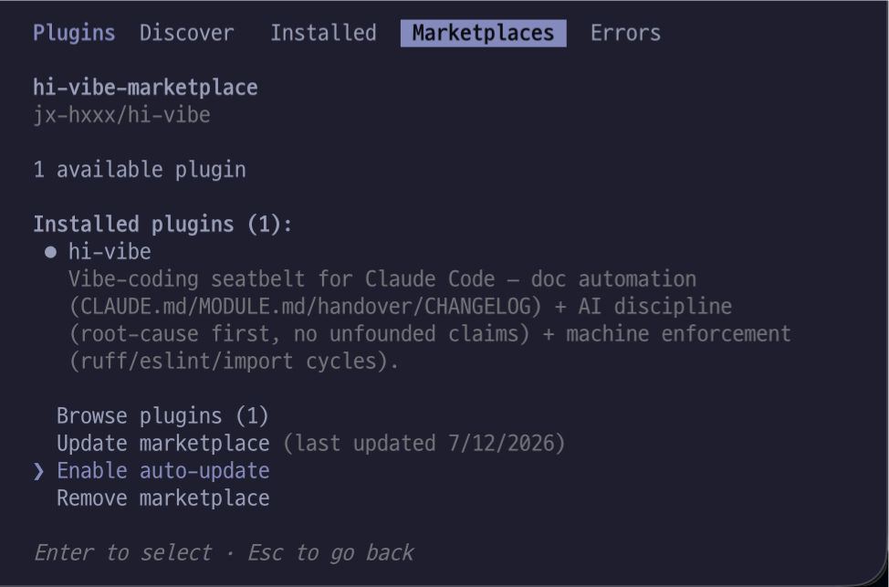

<h1> &nbsp;👋</h1>

[](https://github.com/jx-hxxx/hi-vibe/actions/workflows/test.yml)
[](./LICENSE)


> 🇰🇷 **한국어로 읽으시려면 → [README.ko.md](./README.ko.md)** &nbsp;·&nbsp; 🇬🇧 English continues below.

> **Floor it with AI — hi-vibe is your seatbelt.**

Vibe-coding is convenient, but AI-written code keeps repeating the same problems:

- 😵 Loses memory across sessions and **re-builds similar functions, helpers & types** it already made
- 🩹 On errors, **swallows them in try/except or band-aids with fallbacks/defaults** instead of finding the cause (so bugs hide silently)
- 🤷 Runs with **ambiguous or under-specified requests** on its own, without asking
- 📊 States unverified **API limits, pricing & versions** **as if they were official specs**
- 🗿 **Skips edge cases** and dumps everything into one **"god file"**, and docs drift from the code

`hi-vibe` blocks all of these with three layers: **doc automation + AI discipline + machine enforcement.**

> **⚠️ Not a "bug detector."**
> hi-vibe doesn't scan your code to find bugs — it's a **seatbelt that stops the AI
> from cutting corners.** Catching bugs is still Claude's reasoning; hi-vibe is the
> **discipline, docs, and machinery that force that reasoning to be rigorous.**
> Three tiers, each turned on differently:
>
> - 🔒 **Free once installed (hooks)** — after `init`, every code write is checked for
>   **error-swallowing & hardcoded secrets by the machine**, and handover is saved on
>   each compaction. *The seatbelt that's actually always on.*
> - 🧭 **On demand (find · review · check)** — "make me… / done / find duplicates" runs
>   the discipline checklist and structure scan. Powerful, but **the AI can skip it.**
>   *A coach nagging beside you — ignore it and it won't catch you.*
> - 🛡️ **Opt-in (gate)** — lints complexity & circular deps. Catches the most, but it's
>   **invasive**, so install it once when you're ready (not required).
>
> So it's **not "a tool that auto-catches everything" — it's "a device that forces the
> discipline you'd otherwise skip."** Set expectations there and you won't be let down.

---

## Install

Run these three lines in order, inside Claude Code:

```
/plugin marketplace add jx-hxxx/hi-vibe        ← 1) register the marketplace
/plugin install hi-vibe@hi-vibe-marketplace    ← 2) install the plugin
/reload-plugins                                ← 3) apply it (required!)
```

> **Don't skip step 3, `/reload-plugins`.** Installing alone does NOT turn on
> the commands and hooks yet — this line activates them in the current session
> (no full Claude Code restart needed).

> **Requirement**: Python 3.8+ (the hooks need a `python3` command).
> On Windows without `python3`, create a `python` alias.

> **(Optional) context7 MCP — more accurate when present.** When your code
> touches an external library's API, `find` fetches the **latest official
> docs** instead of relying on the AI's stale memory, preventing outdated code.
> **Not required** — without it, hi-vibe falls back to web search, and if that
> fails too, labels the answer as an estimate. To install it (free API key
> needed) follow the official guide → https://context7.com · Claude Code:
> `claude mcp add --scope user context7 -- npx -y @upstash/context7-mcp --api-key <your_key>`

> **(Optional) claude-hud — if you want to watch your context usage.** It shows
> **remaining context / tokens** live in the status line. It pairs well with
> hi-vibe: watch how much context is left, and when there's room run `/compact`
> — hi-vibe auto-records handover right before that (so "keep context short +
> handover often" becomes visible). Install:
> ```
> /plugin marketplace add jarrodwatts/claude-hud
> /plugin install claude-hud@claude-hud
> /reload-plugins
> ```
> Then run `/claude-hud:setup` to enable the status line.

## First run

Run the first three in order; the last two are optional, whenever you need them:

```
/hi-vibe:welcome    ← start here if you're not sure what to do
/hi-vibe:doctor     ← once after install: actually runs the hooks to verify they work
/hi-vibe:init       ← once per new project: installs the doc system + activates hooks
/hi-vibe:check      ← (optional) structure checkup: find duplicates / god-files — repeat anytime
/hi-vibe:gate --ci  ← (optional) install a quality gate: once per project → auto on every push
```

Run `init` **once per project (folder)** — inside the app folder where you want
to use hi-vibe. The marketplace/install/apply steps (the three lines above) are
done just once on your machine.

> Hooks are designed to **"fail silently"** so they never block Claude Code.
> The trade-off: if `python3` is missing they can be **silently off** — which is
> exactly why `doctor` runs the 4 hooks and the scanner for real to confirm.

Running `init` creates these 4 documents and activates the hooks for this project:

| Document | Role |
|---|---|
| `CLAUDE.md` | Project map — overview, requirements, folder map (keep it lean) |
| `<folder>/MODULE.md` | Per-folder design — features, models, gotchas |
| `handover.md` | Session handover — so the next session doesn't lose context |
| `CHANGELOG.md` | Substantive change history — what changed, and when |

## Occasionally, only when needed (optional)

```
/hi-vibe:check          ← structure checkup (repeat anytime): find duplicates / god-files
/hi-vibe:gate --ci      ← install a quality gate (once per project → auto after)
```

These two have **opposite rhythms** — `check` is **a diagnostic you run** (as
often as you like, within a project), `gate` is **a guard you install once per
project** and it enforces itself from then on.

- **`check`** — never guesses. It speaks only from the scanner's JSON evidence,
  and when saying "not found" it states the scan range. Scans Python + JS/TS
  (`.ts`/`.tsx`/`.jsx` included), and catches not just exact duplicates but
  also **"reimplemented ~90% the same"** function pairs (a classic AI mistake).
  **Run it as many times as you want** — it's the on-demand diagnostic you
  fire whenever code piles up.
- **`gate`** — installs the code checkers **after asking** (never overwrites your
  config). Plain `gate` sets them up **locally** (your editor flags issues); add
  `--ci` to also **gate every push on GitHub** — violations fail the build, so bad
  code can't land. **Install once per project and you're done** — after `--ci`,
  that repo's GitHub checks every push automatically; you never re-run the command
  (only re-run it to change the rules).

## After `init`, everything is automatic

In a project where you ran **`init`** (from "First run" above), everything below
runs on its own (hooks and doc automation are switched on by `init`). No need to
type commands in order — **just talk normally:**

| When you… | What happens | Kind |
|---|---|---|
| the moment code is written | **instant detection** of error-swallowing / hardcoded secrets | ⚙️ machine |
| every compaction | **handover** auto-recorded (context preserved) | ⚙️ machine |
| session start / compact / clear | latest handover + discipline auto-injected | ⚙️ machine |
| substantive change, at session end | reminder if **CHANGELOG** wasn't updated (once/session) | ⚙️ machine |
| "make me this feature" | **find** — searches first for an existing one (prevents duplicate reimplementation) | 🤖 AI |
| "done / review it" | **review** — quality checklist + doc sync | 🤖 AI |
| "review everything" | **review --all** — the whole session at once, feature by feature (skips already-reviewed) | 🤖 AI |
| "review the design" | **review --deep** — a clean-context AI catches over-engineering | 🤖 AI |

> **⚙️ machine** = a Python hook **guarantees** it — it runs regardless of the
> AI's mood.
> **🤖 AI** = a skill instruction that **the AI fires on its own** (reacting to
> natural language like "make me…" / "done"). Powerful, but not a 100%
> guarantee — the AI can skip it. To force it, run the command
> (`/hi-vibe:find` etc.) yourself. Think of the commands as the manual
> lock for when the AI missed the automatic one.
> If a detected error-swallow / secret is **intentional**, add a
> `hi-vibe: allow-swallow` / `hi-vibe: allow-secret` comment on that line to pass.

> **The three reviews.** One `review`, used with options. Plain `review` checks
> **the one feature you just made**; `review --all` checks **everything changed
> this session** at once (files already reviewed and unchanged are skipped —
> great after building several things, then "review everything"). `review --deep`
> **spawns a fresh Claude (a separate agent) that never wrote this code** — so
> with no bias, it uses clean eyes (fresh-eyes) to catch over-engineering and
> hidden coupling the author can't see. `--all` is **how wide** (one→all),
> `--deep` is **who reviews** (the author→a fresh Claude) — different axes, so
> `review --all --deep` works too.

## Commands at a glance

| Command | When | Fires |
|---|---|---|
| `/hi-vibe:welcome` | first time, or when unsure what to use | 🖐 manual |
| `/hi-vibe:doctor` | right after install, or when unsure hooks are running | 🖐 manual |
| `/hi-vibe:init` | once per project (installs the doc system) | 🖐 manual |
| `/hi-vibe:find` | when you say **"make me this feature"** — searches before creating | ⚡ auto |
| `/hi-vibe:review` | when you say **"done / review it"** — checklist + doc sync (`--all` whole session · `--deep` clean eyes) | ⚡ auto |
| `/hi-vibe:handover` | session-end handover | ⚡ auto |
| `/hi-vibe:log` | record a substantive change in CHANGELOG | ⚡ auto |
| `/hi-vibe:recall` | "why did we do it this way before?" — search the records | ⚡ auto |
| `/hi-vibe:check` | full structure checkup — **repeat anytime** | 🖐 manual |
| `/hi-vibe:gate` | install a linter (auto code checker) — machine blocks bad code (**install once → auto**) | 🖐 manual |

> **⚡ auto** = fires on its own from natural language ("make me…" / "done")
> or hooks (e.g. compaction). The command is just a button for when you want
> to be explicit.
>
> **🖐 manual** = you run the command yourself when needed (install / setup / diagnosis).

### What runs underneath — skills (engines) ↔ commands (buttons)

The friendly commands are **buttons**; the real work is done by the **skill (engine)** behind each:

| Skill (engine) | Called by | What it does |
|---|---|---|
| `repo-xray` | `check` | Structure scan — duplicates, dead code, big files |
| `write-gate` | `find` · `review` | Pre- and post-write gates |
| `docs-keeper` | `handover` · `log` · `recall` · `init` · `welcome` | Doc automation + onboarding |
| `guards-setup` | `gate` | Install lint/CI guards |
| `grounded-answers` | (auto) "how much? · supported?" | Stops asserting facts without checking |
| `root-cause-first` | (auto) when fixing a bug/error | Root cause, not a band-aid |

> **Claude Code also exposes each skill as a `/skill-name` slash.** hi-vibe ships the 10
> friendly commands (`check`, `find`…); on top of that, Claude Code auto-opens the 6 skills
> as slashes like `/repo-xray`. So the same engine can be reached **① via the `check` command ② via the
> `/repo-xray` slash ③ by saying "find duplicates" so the AI loads it with `Skill()`**.
> The `hi-vibe:` prefix just means "belongs to this plugin" (shared by commands and skills).
> Only `doctor` runs the hooks/scanner directly, with no skill.

## Updating (when a new version ships)

**✅ Easiest — turn on auto-update once, then forget it:**

`/plugin` → **Marketplaces** tab → `hi-vibe-marketplace` → **Enable
auto-update**. After that, new versions are fetched automatically on every
start. You only run `/reload-plugins` (or just restart Claude Code) to apply
them — no need to type anything below.

<p align="center">
  
</p>

**Manual (if auto-update is off)** — three steps **in order**. ①② are
separate: refreshing the list without swapping the plugin leaves you on the
old version (the most confusing part!).

```
/plugin marketplace update hi-vibe-marketplace   ← ① refresh the latest list
/plugin update hi-vibe@hi-vibe-marketplace       ← ② swap in the new plugin
/reload-plugins                                  ← ③ apply to the current session
```

- Verify: `/plugin` → Installed tab → check the **Version** bumped

## FAQ

**Q. I changed hook settings but nothing happened.**
Hooks load at session start. Restart Claude Code. Use `/hooks` to see load status.

**Q. How do I know hooks are actually running?**
`/hi-vibe:doctor` — it actually runs the 4 hooks and the scanner and shows ✅/❌.
Since hooks fail silently by design, this command is the only reliable check.

**Q. Do hooks run in other projects too?**
No. They only run in a project that has a `.hi-vibe/` folder (= where you ran
`init`); elsewhere they quietly do nothing.

**Q. Won't handover.md grow forever?**
Past 20 entries, the older half auto-moves to `handover-archive.md`. Those
memories aren't lost — `/hi-vibe:recall` (or just asking "why did we do this
before?") searches the archive too and answers with date + source.

**Q. A gate red light (lint warning / CI failure) is showing, but it's not
actually a problem. How do I dismiss it?**
**Telling the AI "it's fine" won't clear it** — the linter re-judges from the
config and code every run; it has no memory of "the user said it's OK." So the
exception has to live **in the code** to stick:
- **Just that one line:** ruff → `# noqa: <rule>`, eslint →
  `// eslint-disable-next-line <rule>`
- **The rule doesn't fit this project at all:** turn it off in the config file
  (`[tool.ruff]` in `pyproject.toml`, etc.) — applies project-wide
- **A hi-vibe error-swallow / secret detection:** add a
  `hi-vibe: allow-swallow` / `hi-vibe: allow-secret` comment on that line
This is deliberate — if one word could silence it, the next session's AI would
forget and the rule would erode. Leaving the exception in the code keeps it
durable, and your teammates can see "this is an intentional exception" too.

**Q. What gets created in my project?**
**Committed to GitHub**: `CLAUDE.md` / `MODULE.md` / `CHANGELOG.md` (project docs).
**Not committed**: `handover.md` · `handover-archive.md` (personal session log),
`.hi-vibe/` (hook state), `.repo-xray/` (scan cache). `init` adds these to
`.gitignore` automatically. (To share handover with a team, just remove that line
from `.gitignore`.)

## Credits / License

- Design inspiration: [lumin-repo-lens](https://github.com/annyeong844/lumin-repo-lens) (MIT) — the prototype of evidence-based discipline ("no claim without a scan")
- License: [MIT](./LICENSE)
